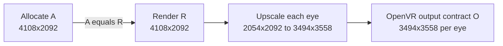
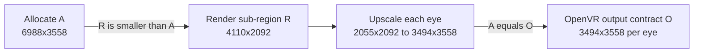
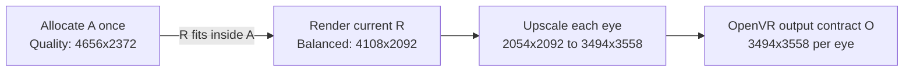
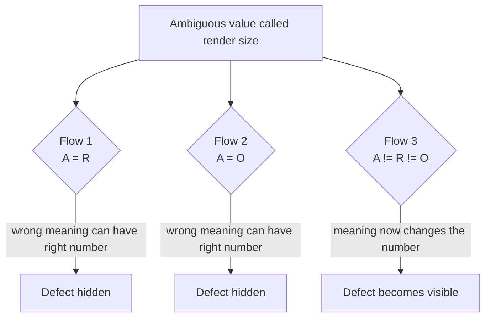
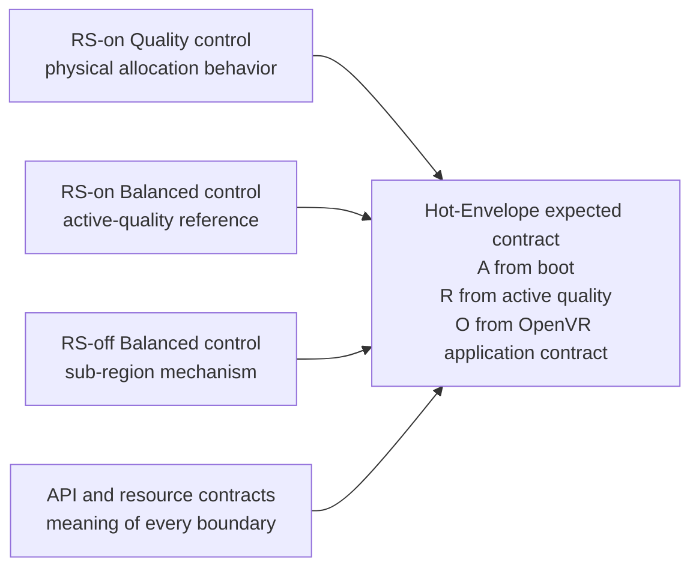
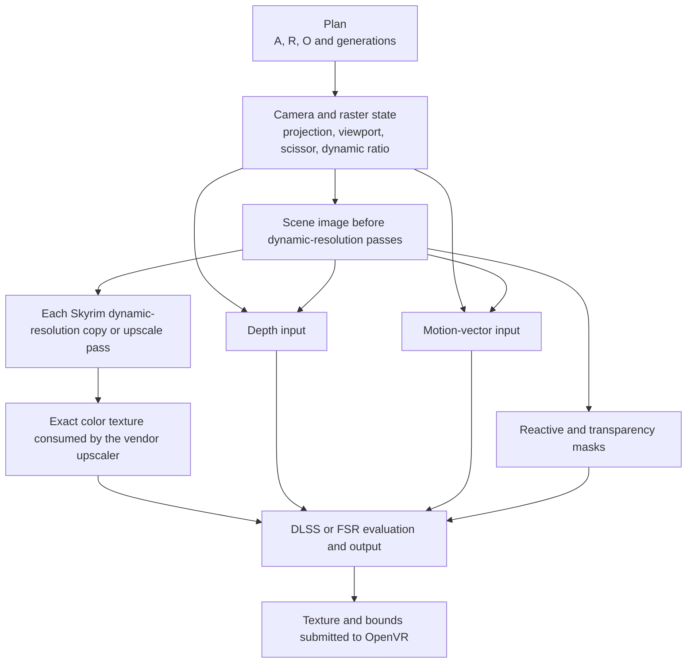
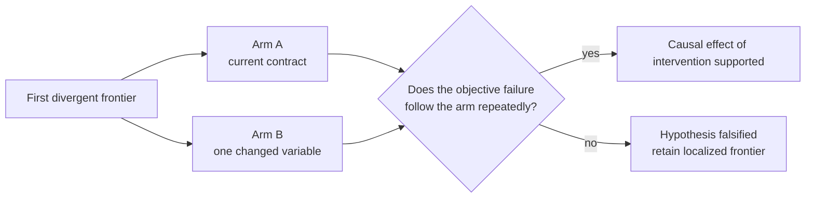
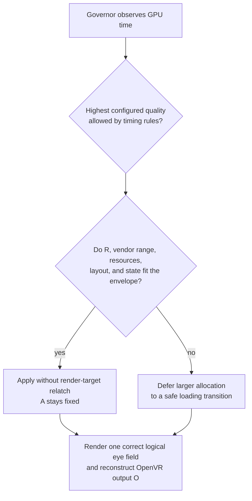

# Explainer: the three VR rendering flows and the Hot-Envelope problem

**Audience:** readers with no prior knowledge of Community Shaders, Skyrim VR,
upscaling, or graphics programming.
**Date:** 2026-08-21.
**Technical baseline:** MGO 4.0 beta RC3, Community Shaders CSX 3.18-VR build 11.

This document explains:

1. why a VR game renders fewer pixels than the headset displays;
2. why dynamically changing image quality is useful;
3. the two working rendering flows and the experimental third flow;
4. why the third flow reveals an ambiguity hidden in the first two;
5. what is currently wrong with its image;
6. the objective strategy designed to find and fix the first failing stage;
7. why the result matters beyond one Skyrim VR setup.

No causal claim or final success decision in this project will depend only on a
visual impression. The current headset symptom is necessarily reported as a
qualitative observation; measured facts, source-derived facts, hypotheses, and
future objective success criteria are labeled separately.

---

## 1. The practical problem

A VR application submits two images, one for each eye, at a high resolution and
strict refresh rate. In the test system, the OpenVR application contract is:

```text
3494 x 3558 pixels per eye
6988 x 3558 as the logical combined-stereo extent
72 new frames per second
13.889 milliseconds per display period
```

The logical combined extent is convenient arithmetic shorthand. It does not
mean that every stage uses one physical side-by-side texture. Resources can be
side by side, separate per-eye textures, or array slices. After submission, the
VR compositor may warp or resample the image for the physical panel; that later
processing is outside `A`, `R`, and `O` in this document.

Missing the frame deadline is especially undesirable in VR. It can cause
stutter, repeated frames, latency, or compositor intervention. The challenge is
therefore not simply to produce the prettiest still image. It is to produce the
highest configured quality that can be completed reliably before the display
deadlines targeted by the controller.

Skyrim VR with Mad God Overhaul 4.0 beta RC3 is a useful research environment
because it creates demanding, variable GPU workloads and includes Community
Shaders, an open-source rendering extension with modern upscalers and a public
plugin API.

### 1.1 Why one fixed quality is wasteful

The GPU cost of a game changes constantly:

- an empty interior may be inexpensive;
- a town, storm, forest, or combat scene may be expensive;
- effects, visibility, and geometry change as the player moves.

If every native-rate deadline must be protected with one fixed quality preset,
that preset must normally accommodate the worst expected scene. This keeps
difficult scenes safer but leaves GPU headroom unused in easier scenes. A higher
configured preset could have rendered more source pixels there.

### 1.2 The Quality Governor

The working Quality Governor addresses that scheduling problem. It observes GPU
time and selects the highest configured upscaling preset allowed by its timing
rules while the game is running:

```text
GPU has spare time  -> render more source pixels -> improve image quality
GPU is overloaded  -> render fewer source pixels -> protect the frame deadline
```

It controls Community Shaders through its public plugin API. The governor itself
works. The unresolved problem concerns how Community Shaders allocates and
interprets render targets when its Render Scale Mode is enabled.

---

## 2. What upscaling does

An upscaler lets the game render a smaller source image and reconstruct the
larger image required by the OpenVR application contract.

The configured preset ladder runs from NativeAA and high-quality modes down to
Quality, Balanced, Performance, and UltraPerformance. Moving down that list
generally renders fewer source pixels. For example, the **Balanced** preset with
Render Scale on renders:

```text
2054 x 2092 pixels per eye
```

and reconstructs:

```text
3494 x 3558 pixels per eye
```

Rendering fewer source pixels saves GPU time. DLSS then uses the source color,
depth, motion, camera information, and temporal history to construct the final
image.

The important point is that at least three different sizes exist in this
process. They must not be treated as interchangeable.

---

## 3. The three geometries

This research uses three symbols consistently:

| symbol | name | plain-language meaning |
|---|---|---|
| `A` | Allocation | how large a physical image resource Skyrim reserves in GPU memory |
| `R` | Render extent | how much image area is actively rendered for the current quality |
| `O` | Output | how large the image submitted by the application to OpenVR must be |

An analogy is useful:

```text
A = the size of a sheet of paper
R = the area currently drawn on that paper
O = the size of the final poster delivered to the viewer
```

The sheet size, drawing size, and poster size are separate facts. A program must
also know where the drawing begins on the sheet and whether it has already been
enlarged. Resource dimensions alone cannot answer that.

`A = O` below means equal dimensions, not the same resource or the same image
state. Likewise, a "combined stereo" number is a logical two-eye extent; each
concrete resource still needs an explicit side-by-side, per-eye, or array-slice
layout.

### 3.1 A small glossary

| term | meaning here |
|---|---|
| Texture/render target | an image resource stored in GPU memory |
| Preset | one configured upscaling quality level |
| Compositor | VR runtime component that receives application eye images and prepares display presentation |
| Relatch | Community Shaders recreates physical render targets and render-target-dependent state for a new size |
| Boundary | an observable handoff between two rendering operations |
| Contract | the pre-declared meaning, dimensions, region, and coordinate mapping required at a handoff |
| Frontier | the earliest observed failing handoff or set of parallel handoffs whose predecessors pass |
| Projection | mathematical mapping from the 3D world into one eye's 2D image |
| Viewport/scissor | rectangles controlling where drawing is mapped and allowed inside a target |
| Rasterization | conversion of projected 3D geometry into image pixels |
| Normalized coordinate | position expressed from 0 to 1 instead of in physical pixels |
| Temporal history | information retained from earlier frames |
| Opaque block | code, such as private DLSS internals, whose inputs and outputs are observable but whose internal state is not |
| P95 GPU time | the 95th-percentile GPU frame time: 95% of accepted samples are at or below it |

### 3.2 Size is not coordinate state

Suppose a texture is 2328 pixels wide. It could contain:

1. a 2054-pixel image in part of the texture, still waiting to be enlarged; or
2. the same image already enlarged to fill all 2328 pixels.

Both textures have the same physical dimensions. If code assumes case 1 while
the texture is actually case 2, it may crop 2054 pixels from an already enlarged
image and enlarge that crop again. The result is a deterministic zoom, even
though every texture dimension appears legal.

The investigation must therefore track both:

```text
How large is the resource?
Which logical part of the eye image do its pixels represent?
```

---

## 4. Flow 1: Render Scale Mode on

Render Scale Mode changes Skyrim's physical render-target allocation. Instead
of allocating at the application's full output extent, it allocates at the
selected quality's smaller source size.

At Balanced quality:

```text
A = 4108 x 2092 combined stereo
R = 4108 x 2092 combined stereo
O = 6988 x 3558 combined stereo
```

Therefore:

```text
A = R
```

The whole smaller allocation is rendered, and the upscaler reconstructs the
full OpenVR application output.

Balanced is 2054 pixels wide per eye on this path but 2055 per eye with Render
Scale off. Community Shaders uses different documented arithmetic: Render Scale
on scales each eye and forces even dimensions, while Render Scale off scales the
combined width and truncates. The one-pixel difference is retained in every
comparison rather than rounded away.



### 4.1 Benefit

Smaller physical render targets are expected to reduce work beyond the simple
number of shaded pixels. In one two-session route comparison, 45 minutes apart,
Render Scale-off P95 GPU time was 1.63 to 2.47 ms higher across the tested
presets. The setting was read from disk in both sessions and GPU samples were
deduplicated by frame identity. This is a large observed difference relative to
a 13.889 ms display period, but it is evidence from one route, machine, and
headset rather than a universal per-scene saving.

### 4.2 Problem for dynamic switching

In the shipped design, changing quality under Render Scale Mode changes the
required physical texture dimensions. Community Shaders therefore recreates
render targets and dependent resources. The project reports 96 to 130 ms for the
relatch operation: the interval occupied by render-target recreation,
`globals::ReInit()`, and dependent rebuild work. This is not the same metric as
the worst single presented frame, which was measured separately.

This flow produces a working image in the tested menu-closed conditions and is
associated with lower route P95 GPU time, but repeated dynamic quality changes
produce severe transition disruption.

---

## 5. Flow 2: Render Scale Mode off

With Render Scale Mode off, Skyrim keeps full-size physical targets but renders
only a smaller active region inside them.

At Balanced quality:

```text
A = 6988 x 3558 combined stereo
R = 4110 x 2092 combined stereo
O = 6988 x 3558 combined stereo
```

Therefore:

```text
A = O
```

The allocation stays fixed when quality changes. Only the active render region
and upscaler input change.



### 5.1 Benefit

Because the allocation does not change, the governor can switch quality without
the Render Scale relatch. In the compared runs, frames beyond two display
periods were 0.03% with Render Scale off versus 1.35% with it on, and the worst
frame within 0.5 seconds of a change was 34 ms versus 59 ms. This is
substantially cleaner, not perfectly stall-free.

### 5.2 Cost

The physical targets remain at the full application-output extent. In the
two-session route comparison, P95 GPU time was 1.63 to 2.47 ms higher than with
Render Scale on. The governor consequently selected lower-quality presets more
often in the compared data.

This flow produces a working image and substantially smoother transitions in
the tested conditions, but the observed additional GPU cost reduces the quality
the governor can select.

---

## 6. Flow 3: Hot-Envelope

Hot-Envelope is the experimental attempt to keep the advantages of both working
flows.

The idea is simple:

> Allocate once at a chosen upper quality. Lower-quality render extents fit
> inside that allocation, so switching downward should not require reallocating
> the textures.

If the game boots at Quality and later selects Balanced:

```text
A = 4656 x 2372, fixed by boot Quality
R = 4108 x 2092, selected by active Balanced
O = 6988 x 3558 logical combined extent, fixed by the OpenVR application contract
```

Now all three differ:

```text
A != R != O
```



Geometric containment is necessary but not sufficient. A lower quality may
avoid a render-target relatch only if its render region fits and its vendor
input range, resource alignment, provider state, histories, and concrete
resource layouts are also valid. A quality larger than the allocation still
requires a real relatch and can be deferred to a loading screen. Vendor context
creation or cache eviction may still add transition cost even without a
render-target relatch.

### 6.1 What already works

The physical-envelope mechanism has been demonstrated:

- the boot allocation can remain fixed across lower-quality changes;
- one session relatch replaced 171 relatches in a comparison run;
- GPU time still decreases monotonically down the quality ladder;
- the governor continues to request and change qualities.

This demonstrates that the physical allocation can remain fixed while lower
qualities are requested and rendered with lower GPU cost. It does not yet prove
that the allocation is a functionally correct upper bound, because the resulting
image remains wrong.

### 6.2 What does not work

The user-observed image below the envelope quality is wrong: it appears too
close and flattened into layers. These are qualitative observations used to
describe and reproduce the symptom, not to prove its cause:

- is present with either eye viewed alone, so it is not only a disagreement
  between left and right eyes;
- is absent at the envelope quality, where `A = R`;
- becomes more severe as `R` becomes smaller relative to `A`;
- remains despite several attempted corrections to eye origins and auxiliary
  input regions;
- occurs even though the submitted output texture is active across its full
  width and the OpenVR output bounds are correct.

The last item is objective trace evidence. The monocular and severity items are
headset observations that the new protocol is designed to replace with measured
coordinate mappings.

The relatch optimization works, but the image is not yet acceptable. Correctness
must be solved before performance success can be claimed.

### 6.3 What the simple arrows do not show

The flow diagrams show logical sizes, not the physical x position of each eye
inside every texture. At Balanced inside a Quality envelope, two possible
side-by-side layouts illustrate the missing information:

```text
Packed active stereo inside A = 4656

0                  2054                4108        4656
|---- left R_eye ----|---- right R_eye ---| unused |

Allocation-separated active stereo inside A = 4656

left allocation [0,2328):       active [0,2054),       unused [2054,2328)
right allocation [2328,4656):   active [2328,4382),    unused [4382,4656)
```

An image can also be expanded so each complete eye fills its 2328-pixel
allocation half. These states share the same outer texture size but require
different crops and vendor inputs.

Different resources and stages may legitimately use different layouts. The
Hot-Envelope error cannot be solved by declaring one raw x origin universally
correct. The protocol must measure the producer/consumer contract at each
handoff and compare logical eye coordinates.

---

## 7. Why the first two flows hide the defect

The shipped Community Shaders geometry has two working configurations:

| flow | equality that holds |
|---|---|
| Render Scale on | `A = R` |
| Render Scale off | `A = O` |

This creates a subtle software problem. Mode-specific code can call a value
"render size" and use it for different meanings without producing a wrong
number in its own shipped flow.

For example:

- code needing `A` but receiving `R` still works in Flow 1 because `A = R`;
- code needing `A` but receiving `O` still works in Flow 2 because `A = O`;
- Hot-Envelope exposes either confusion off its diagonal because `A`, `R`, and
  `O` are different.



This is not evidence that the shipped flows are defective. Their respective
equalities make one distinction unnecessary in each mode. Hot-Envelope is the
first mode that requires the program to preserve all three meanings
simultaneously.

---

## 8. Why the solution is not another guessed replacement

Several locally plausible fixes failed because they changed one consumer while
the rest of the pipeline still used a different interpretation. Visual testing
could show that an attempt was wrong, but it could not reliably identify the
first stage where the image became wrong.

The new strategy will treat rendering as a finite dependency graph and record
the image's meaning at each boundary.

It asks:

```text
What resource was used?
What are its physical dimensions?
Where does each eye begin?
What active extent is valid?
Which normalized part of the eye image do those pixels represent?
Has that image already been scaled or cropped?
Which camera, motion, depth, history, and vendor state belong to it?
```

The complete execution protocol is:

`PLAN_COMPOSITIONAL_DIFFERENTIAL_ORACLE.md`

---

## 9. The compositional differential strategy

The two working flows are used as controls, not as unconditional proof of every
intermediate step.

For Hot-Envelope booted at Quality and active at Balanced:

- RS-on Quality provides the known physical allocation contract;
- RS-on Balanced provides a known active-quality render reference;
- RS-off Balanced demonstrates working VR sub-region rendering;
- both working flows provide the final OpenVR application-output contract.

An "off-diagonal" case means boot allocation and active preset differ, such as
boot Quality with active Balanced. Each such Hot-Envelope rule must also have an
independent authoritative source, such as an API contract, explicit
producer/consumer contract, or resource-layout rule that distinguishes `A`,
`R`, and `O`. The implementation being tested is not allowed to define its own
correctness.



The result is a set of pre-registered predictions for the pipeline, followed by
measurements that can pass, fail, or be declared inconclusive.

---

## 10. The objective pipeline bisect

The planned investigation will record these boundaries:



This is a graph rather than one simple line because DLSS receives several inputs
in parallel. Color, depth, and motion may use different physical textures or
origins while still referring to the same logical eye pixels.

### 10.1 What is measured

The records will include:

- exact integer dimensions and half-open regions;
- whether a size is combined stereo, per eye, or an array slice;
- resource identity, format, and generation;
- copy, crop, viewport, and scissor regions;
- camera and previous-camera matrices;
- current and previous dynamic-resolution ratios;
- provider quality, preset, viewport slot, and tagged extents;
- history resets and exposed temporal-resource identities;
- final OpenVR texture and bounds.

An objective coordinate instrument and offline analyzer are designed to
determine which logical part of the eye image exists at each color boundary.
Projection, depth, motion, and masks will use separate metrics appropriate to
their meanings.

### 10.2 The first-divergence result

If the plan and camera are correct, but a dynamic-resolution output is the first
place with a wrong mapping, its producer/input handoff lies on the earliest
observed divergent frontier. This does not by itself prove which source line is
faulty. If every exposed vendor input is correct but its output is wrong, vendor
evaluation becomes the smallest named opaque block.

This result does not yet prove root cause. It identifies where a controlled
causal experiment must begin.

---

## 11. Why localization is guaranteed conditionally

Consider one finite path:

```text
valid input -> stage 1 -> boundary 1 -> stage 2 -> ... -> invalid endpoint
```

If all relevant boundaries are observable, the contracts are sound, the
diagnostic does not change behavior, and the endpoint is objectively known to
be wrong, there must be a first boundary or dependency edge that fails.

The reason is simple:

1. the endpoint is in the set of invalid observations;
2. the pipeline has a finite number of ordered dependencies;
3. a non-empty finite ordered set has a first invalid member;
4. its relevant predecessors pass, so it forms the first divergent frontier.

For parallel inputs, the analyzer walks backward through the actual dependency
graph rather than pretending all resources form one image sequence.

The guarantee is conditional. If a boundary cannot be captured, a contract
cannot distinguish two interpretations, or instrumentation changes the path,
the result is explicitly `INCONCLUSIVE` or `DIAGNOSTIC_INTERFERENCE`. It is not
reported as success.

---

## 12. How causality is established

After localization, one variable is changed at the divergent frontier. The two
arms are repeated in counterbalanced order with identical reset, warm-up,
settle, and washout treatment.

Examples include:

- consume raw `R` content versus a complete image already expanded to `A`;
- suppress one earlier expansion versus permit it and consume its complete
  output;
- use active-quality versus boot-quality provider state;
- correct one auxiliary logical mapping while preserving its physical layout.

If the objective failure repeatedly follows that one variable in the predicted
direction, the causal effect of that intervention is supported under the
recorded conditions. This does not automatically exclude every alternative
internal pathway. If it does not follow the variable, the hypothesis is
rejected while the localized frontier remains useful.



---

## 13. The leading hypothesis

The leading hypothesis is a duplicate spatial transform, but the protocol does
not assume it is true.

If an earlier Skyrim pass has already expanded the complete image from `R` to
fill `A`, but the submit path then crops only `R` pixels and expands that crop
again to `O`, the predicted horizontal zoom is:

```text
zoom = A_eye / R_eye
```

For a Quality envelope:

| active quality | predicted zoom if double-scaled |
|---|---:|
| Balanced | about 1.13x |
| Performance | about 1.33x |
| UltraPerformance | 2.00x |

This is consistent with the qualitative severity ordering and naturally becomes
zero error when `A = R`. That makes it a strong candidate, not a proven cause.

The hypothesis is rejected if the complete boundary ledger proves there was no
earlier `R -> A` expansion and the vendor receives one complete raw `R` field.

---

## 14. Why this work is important

### 14.1 It addresses variable workloads rather than one benchmark scene

A fixed preset optimizes for one assumed workload. A dynamic governor spends
available GPU time according to the current scene. If the Hot-Envelope is made
correct, the system can combine:

- higher image quality when headroom exists;
- lower quality when required to protect the frame deadline;
- smaller physical allocations and their measured GPU benefit;
- changes without the reported 96 to 130 ms render-target relatch operation,
  while separately measuring any remaining provider/cache transition cost.

That is a different operating principle from selecting one best-fit preset.

### 14.2 The measured opportunity is large

In the recorded comparisons on the test system:

- Render Scale-off route P95 was 1.63 to 2.47 ms higher than Render Scale-on;
- the display period at 72 Hz is 13.889 ms;
- dynamic switching with Render Scale off had far cleaner frame delivery;
- dynamic switching with Render Scale on selected better quality overall but
  suffered severe transition stalls.

The proposed third flow targets the missing combination: the quality benefit of
small allocations and the delivery behavior of fixed allocations.

### 14.3 It exposes a general software-engineering class of defect

The `A`, `R`, and `O` ambiguity is not unique to Skyrim. Any rendering system
can hide semantic confusion when two quantities happen to be equal in every
shipped mode. A new mode that separates them can reveal assumptions spread
across allocation, rasterization, post-processing, temporal reconstruction, and
presentation.

The useful general lesson is:

> A texture's dimensions do not describe the logical coordinate state of the
> image stored inside it.

Tracking typed extents, explicit resource layouts, and composed coordinate
transforms can expose and reduce this class of failure. Types alone cannot stop
a programmer from passing one raw width component where another is required.

### 14.4 It improves the quality of the evidence

The strategy separates five claims that could otherwise be conflated:

1. the fixed allocation can survive quality changes;
2. every scored image-space transform passes its objective contract;
3. one controlled intervention repeatedly causes the objective correction;
4. the two existing flows do not regress;
5. the corrected flow retains the measured performance benefit.

This makes the result reproducible and falsifiable. It also records negative
results instead of silently replacing them with the latest explanation.

---

## 15. What has and has not been proved

### Already demonstrated

- The external governor can change Community Shaders quality during play.
- Render Scale Mode provides a measured GPU benefit on the test system.
- Render Scale relatches cause severe transition stalls.
- A boot-quality allocation can remain fixed across lower-quality changes.
- GPU cost still declines down the quality ladder under that fixed envelope.
- The Hot-Envelope image is qualitatively observed to be wrong below the
  envelope quality; objective coordinate localization is not complete.

### Not yet demonstrated

- The exact first divergent pipeline frontier.
- The causal effect of an isolated correction at the first-divergence frontier;
  identifying a deeper internal mechanism may require additional evidence.
- A corrected Hot-Envelope image across the required feature checklist.
- Final performance matching the desired combination of Flows 1 and 2.
- Generality across other headsets, GPUs, games, or rendering engines.

The new protocol exists to establish the first four items objectively. Testing
other systems would strengthen generality after the mechanism is correct.

---

## 16. Intended final result

A successful implementation should behave as follows:



The desired system does not search once for a single permanent preset. It
continuously chooses the highest configured quality allowed by its controller,
while a fixed physical envelope is intended to prevent fitting routine quality
changes from rebuilding render targets.

---

## 17. Further reading

| document | purpose |
|---|---|
| `README.md` | project summary and measured headline results |
| `FINDINGS-FOR-CS.md` | independent findings about Community Shaders VR |
| `docs/CSX_HOT_ENVELOPE_POC.md` | original proposal, implementation history, and failures |
| `docs/PLAN_GEOMETRY_TYPE_SPLIT.md` | technical separation of allocation, render, and output extents |
| `docs/PLAN_COMPOSITIONAL_DIFFERENTIAL_ORACLE.md` | complete executable first-divergence localization and causal-intervention protocol |
| `docs/MEASUREMENT_METHOD.md` | measurement controls and lessons from invalid earlier comparisons |

---

## 18. One-paragraph summary

The working governor dynamically changes VR upscaling quality so easy scenes can
use more image detail and difficult scenes can protect the frame deadline. With
Community Shaders Render Scale Mode on, one route comparison measured 1.63 to
2.47 ms lower P95 GPU time, but fitting quality changes still invoke a reported
96 to 130 ms render-target relatch operation. With it off, transitions were
substantially cleaner but that measured P95 advantage was lost.
Hot-Envelope keeps one boot-quality allocation and renders lower qualities
inside it, aiming to combine both benefits. Its allocation and performance
behavior work, but its image is qualitatively wrong when allocation size, active
render extent, and output size differ. The cause has not yet been established;
inconsistent coordinate handling is the leading hypothesis. The new strategy
will record every dependency boundary, identify the earliest objective contract
divergence, and then change one variable in a counterbalanced experiment to test
causality before applying a minimal fix.
