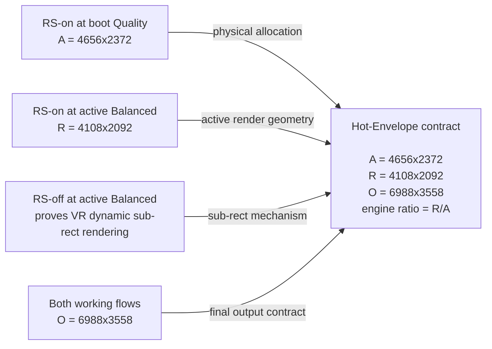
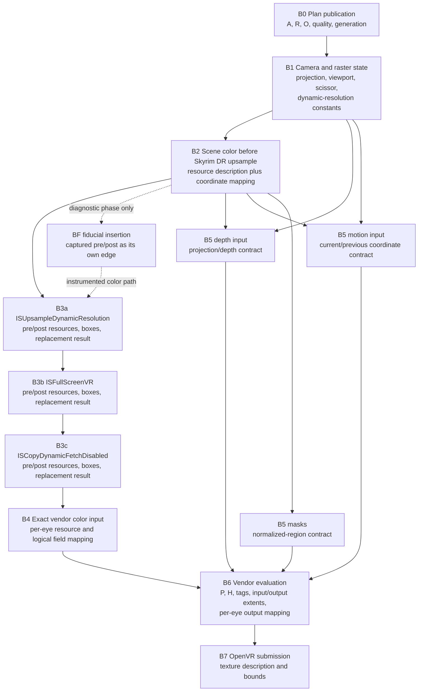
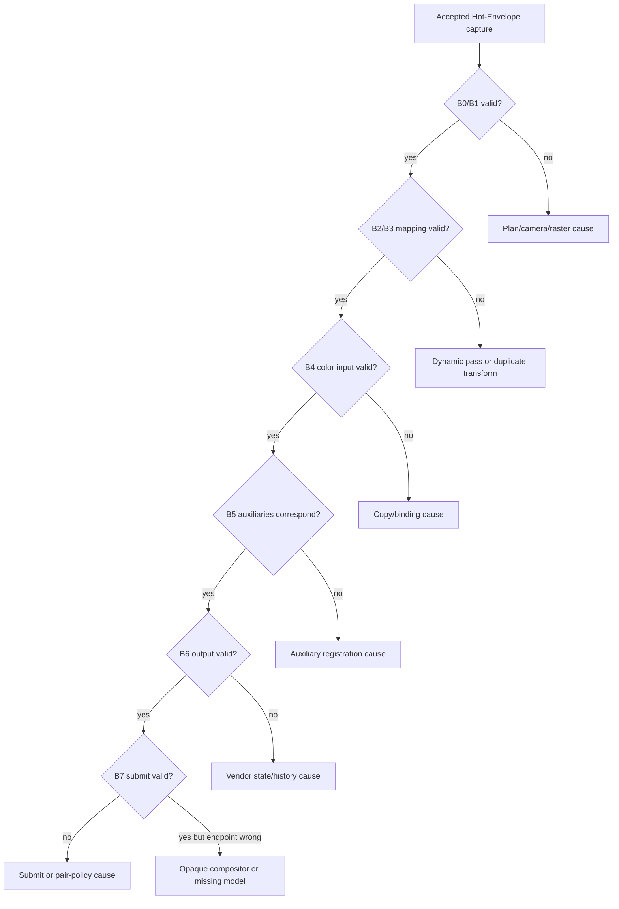

# Plan: compositional differential oracle for Hot-Envelope

**Status:** execution protocol, written before implementation.
**Date:** 2026-08-21.
**Source baseline:** MGO 4.0 beta RC3, CSX 3.18-VR build 11,
tag `CSX3.18`, commit `2051e2aead1b2bb2b03faa421201376e8bc84fe0`.

This document defines an objective strategy for finding the first stage that
corrupts Hot-Envelope geometry. It is intended to be executed in order. A later
result may narrow the work, but it must not retroactively change a hypothesis,
threshold, or pass criterion recorded here.

The strategy has three parts:

1. use the two working rendering flows as pairwise controls that constrain, but
   do not uniquely determine, the intended Hot-Envelope contract;
2. derive each off-diagonal Hot-Envelope invariant independently from source,
   API contracts, and explicit resource-layout rules;
3. record the coordinate transform at every relevant pipeline edge and find the
   first observed divergence from those pre-registered invariants.

This is called a **compositional differential oracle**. It replaces visual
guessing with a finite pipeline bisect.

---

## 1. Goal and promised outcome

The immediate goal is not to guess a patch. It is to produce one of these
objective outcomes:

1. identify the minimal observable edge or frontier where a valid state first
   diverges from its pre-registered relational contract;
2. if a stage is opaque, identify the smallest named opaque block across which
   correct input becomes incorrect output;
3. demonstrate that the current model is incomplete by finding an observation
   that none of its pre-registered states can explain.

Outcome 1 or 2 localizes the first **observed contract divergence**. It does not
by itself prove root cause: a later intervention is required for causality.
Outcome 3 identifies which theorem assumption class failed and what additional
measurement is required; it need not reveal the exact missing variable on the
first pass.

This protocol does **not** promise in advance that the first capture will name a
particular source line. Skyrim and DLSS contain opaque code. Under the stronger
assumptions in section 6, it promises a smaller interval in which the first
observable divergence occurs.

No subjective headset judgement is used to localize the divergence or establish
causality. Visual testing is retained as a qualitative release-safety gate after
the objective evidence passes; it can reject a build as unsafe, but it cannot
select or prove an explanation.

---

## 2. Definitions

No geometry value is unqualified. Every extent and origin is tagged as one of:

```text
CombinedStereo
PerEye(eye index)
ArraySlice(eye index, slice)
```

Tables may use combined stereo for compactness, but runtime and analyzer records
must carry the tag. Pixel regions use half-open pixel-edge coordinates
`[left,right) x [top,bottom)`. A texel sample center is `(x + 0.5, y + 0.5)`.
Affine transforms map normalized logical **boundaries**; sample-center conversion
is explicit. Exact integer containment and seam checks use zero tolerance and
are never weakened by image-fit tolerances.

| symbol | meaning |
|---|---|
| `A` | physical allocation extent of the engine render target |
| `R` | active logical render extent for the current quality |
| `O` | final headset/compositor output extent |
| `C` | coordinate state: where the complete logical eye image exists inside a concrete resource |
| `L` | concrete resource layout: packed stereo, allocation-separated stereo, per-eye texture, or array slice |
| `P` | vendor provider state: DLSS/FSR mode, preset, viewport slot, accepted input range, and generation |
| `H` | exposed temporal state: matrices, jitter, ratios, history resources, reset sequence, and generation; opaque provider history remains inside B6 |

`A`, `R`, and `O` answer **how large** three logical geometries are. `C` and
`L` answer **where the pixels are** and what coordinate system they currently
represent. The distinction is load-bearing.

An `A`-sized texture may contain either:

- a raw full-field image occupying an `R`-sized region; or
- an image already expanded from `R` to fill an `A`-sized region.

Those textures have the same D3D description and can have activity across the
same columns, but they require different next operations. Cropping `R` pixels
from the second case and expanding them again produces a deterministic zoom.

### 2.1 Coordinate transform notation

For each eye and boundary, represent the placement of logical normalized eye
coordinates `(u, v)` in physical resource pixels as an affine transform:

```text
[x y 1]^T = M_i [u v 1]^T
```

`M_i` records scale and origin. It therefore distinguishes all of these cases:

```text
raw packed eye:               width R_eye, origin 0 or R_eye
raw allocation-separated eye: width R_eye, origin 0 or A_eye
expanded allocation eye:      width A_eye, origin 0 or A_eye
final per-eye output:          width O_eye, origin 0
```

Every crop, copy, resolve, upscale, viewport, and submit operation has its own
transform `T_i`. A correct stage satisfies:

```text
M_out = T_i * M_in
```

For the spatial-placement invariant tested here, the pipeline is correct when
the full logical eye field maps exactly once to the complete output eye. A
second scale or crop is visible in the composed matrix even when every
individual dimension is numerically valid. Separate contracts are required for
projection, depth, motion, masks, temporal correspondence, and nonlinear vendor
reconstruction; an affine color fit does not prove those contracts.

---

## 3. The three flows

For a display of 3494 x 3558 per eye, the known contracts are:

| flow | allocation `A` | render `R` | output `O` |
|---|---|---|---|
| Render Scale off | display | active quality size | display |
| Render Scale on | boot quality size | same as allocation | display |
| Hot-Envelope | boot quality size | active quality size | display |

The important equalities are:

```text
Render Scale off: A = O
Render Scale on:  A = R
Hot-Envelope:     A != R != O, except on the envelope diagonal
```

This explains why an ambiguous consumer can work in both shipped flows:

- Render Scale on cannot reveal confusion between allocation and render,
  because they have the same value.
- Render Scale off cannot reveal confusion between allocation and output,
  because they have the same value.
- Hot-Envelope is the first flow in which neither confusion is numerically
  hidden.

Correct final images in the first two flows do **not** prove that every
intermediate consumer is semantically correct. They prove that the consumers
are numerically correct on two intersecting planes. The third flow moves off
both planes and exposes the distinction.

### 3.1 Concrete Balanced example

Boot Hot-Envelope at Quality and select Balanced:

| reference | `A` | `R` | `O` |
|---|---:|---:|---:|
| RS-on Quality | 4656 x 2372 | 4656 x 2372 | 6988 x 3558 |
| RS-on Balanced | 4108 x 2092 | 4108 x 2092 | 6988 x 3558 |
| RS-off Balanced | 6988 x 3558 | 4110 x 2092 | 6988 x 3558 |
| Hot Quality/Balance | 4656 x 2372 | 4108 x 2092 | 6988 x 3558 |

The two-pixel width difference between RS-off Balanced and Hot-Envelope
Balanced is known arithmetic behavior, not evidence of the visual defect:

```text
RS-off scales combined stereo width and truncates: 4110
RS-on/Hot scales per eye and forces even:           4108
```

Comparisons must use the authoritative integer extent for each flow and compare
normalized logical coordinates. They must not silently force the two arithmetic
paths to one value.

### 3.2 How the Hot-Envelope contract is composed



The controls constrain the design but do not mathematically identify every
off-diagonal consumer. Infinitely many implementations can agree whenever
`A = R` and whenever `A = O`, yet disagree when all three differ. Therefore the
arrows above are candidate composition rules, not proof.

Before a boundary can be scored, its off-diagonal invariant must have a
**normative source that distinguishes the competing mappings**. Acceptable
normative sources are:

```text
documented OpenVR, D3D, vendor, or engine API contract
explicit producer/consumer data contract whose named semantics distinguish A, R, and O
physical containment or coordinate identity that makes only one candidate possible
an independently specified resource-layout policy, validated before the scored consumer
```

The current implementation being audited, a general containment rule that both
candidates satisfy, or a control where the competing values are equal may
support characterization but cannot be the sole normative source. Require a
second independent check, such as a working-flow control or compile-time policy
test. If no normative source distinguishes the candidates, mark the edge
`INCONCLUSIVE_CONTRACT`; do not let implementation behavior define its own
correctness.

The experiment then tests those pre-registered invariants and determines
whether a concrete resource contains raw `R` content or content that has
already become `A`.

---

## 4. Central hypothesis and falsifier

The leading hypothesis is a duplicate spatial transform, but this plan does not
assume it is true.

### H1: duplicate expansion or crop

Skyrim may already expand the complete `R` image to `A`, after which the
submit-stage path crops an `R`-sized portion and asks DLSS to expand it to `O`.
If so, the apparent monocular magnification is:

```text
zoom_x = A_eye_width  / R_eye_width
zoom_y = A_eye_height / R_eye_height
```

For a Quality envelope:

| active preset | `A_eye` | `R_eye` | predicted horizontal zoom |
|---|---:|---:|---:|
| Balanced | 2328 x 2372 | 2054 x 2092 | about 1.13x |
| Performance | 2328 x 2372 | 1746 x 1778 | about 1.33x |
| UltraPerformance | 2328 x 2372 | 1164 x 1186 | 2.00x |

This prediction is consistent with the reported ordering, the monocular nature
of the defect, and the image being correct when `A = R`. Consistency is not
proof.

### Falsifier for H1

The proposed mechanism is falsified only if the complete boundary ledger shows
no preceding `R->A` expansion and the capture immediately before the
submit-stage source copy shows that the complete logical eye field occupies
exactly `R_eye` pixels. Seeing an `R_eye` field at one boundary alone is not
enough: it could have been expanded and resampled back earlier.

If the complete field occupies `A_eye`, H1 is supported and the current
`R_eye` crop is invalid. If neither candidate fits, the first earlier boundary
where the measured mapping changed becomes the target.

No visual statement such as "this looks zoomed" decides this test. The fitted
coordinate transform decides it.

---

## 5. Functional pipeline view



The graph is scored by dependency edges, not by treating color, depth, motion,
masks, vendor output, and submit metadata as one linear image sequence. The
result is a minimal invalid frontier: one or more edges across which valid
upstream records first fail their relational contracts. It is the starting
point for causal intervention, not root-cause proof by itself.

### 5.1 Required record at every boundary

Every record must carry enough identity to join it to one eye of one compositor
cycle:

```text
run ID
build commit and DLL SHA-256
frame ID
compositor-cycle token
eye index
transition epoch
physical-contract generation
history generation/reset state
requested quality and runtime/provider quality
A, R, O with CombinedStereo/PerEye/ArraySlice tags
resource stable ID, subresource, format, width, height, array size, samples
active half-open origin and extent with coordinate-space tag
viewport and scissor
source and destination boxes
current and previous dynamic-resolution ratios
current and previous projection/view matrices
current and previous persistent history-resource IDs where exposed
vendor mode, preset, viewport slot, tagged extents, and evaluation result
```

Pointer values alone are not stable resource identities. Assign each observed
resource a diagnostic ID at creation or first observation and log pointer,
description, subresource, and generation together.

---

## 6. Why this strategy localizes the first divergence

### 6.1 Conditional localization theorem

For one linear dependency path, model one rendered eye as a finite ordered
sequence of stages:

```text
X_0 -> F_1 -> X_1 -> F_2 -> ... -> F_n -> X_n
```

`X_i` is the relevant state at boundary `i`, including `A`, `R`, `O`, `C`,
`L`, `P`, and exposed `H`. `F_i` is the stage between two boundaries. Let
`ValidNode_i(X_i)` mean that the state satisfies its boundary invariant, and let
`ValidStep_i(X_(i-1), X_i)` mean that the output has the required relationship
to the actual input and that the stage's preconditions were satisfied.

Assume:

1. the actual path for the captured eye is finite and its stage order is
   recorded;
2. an authoritative pre-pipeline boundary `B-1` and B0 input state are valid;
3. an absolute normalized-coordinate oracle establishes an objectively invalid
   pre-submit endpoint, or the conclusion is explicitly limited to an earlier
   invalid boundary;
4. every relevant stage has an observable boundary before and after it, or is
   explicitly grouped into one named opaque block;
5. the recorded state and relational contracts are sound and complete for the
   specific invariant under test; an opaque block is not claimed complete;
6. diagnostics do not change stage selection, dimensions, resources, matrices,
   provider state, or synchronization relevant to the result;
7. the validity predicates distinguish every state relevant to the spatial,
   projection, auxiliary, or temporal invariant being scored.

Then there exists a smallest index `k` such that either:

```text
ValidNode_(k-1)(X_(k-1)) and not ValidStep_k(X_(k-1), X_k)

or

ValidStep_k(X_(k-1), X_k) and not ValidNode_k(X_k)
```

Therefore `F_k`, its inputs, or the named opaque block containing it is the
first **observed contract divergence** on that path. Root causality requires
the intervention in Phase 8.

### 6.2 Proof

The endpoint's absolute invalidity makes the set of invalid nodes or incoming
relational edges non-empty. The path is finite and ordered, so that set has a
least element `k`. Every earlier node and step passes by minimality. Thus the
first observed violation lies at `F_k`, its input binding, or state inside its
declared opaque block. Sound relational contracts prevent an earlier invalid
state from being called valid merely because a later stage preserved it.
Assumption 6 rules out the instrument as the difference. This proves a first
divergence, not root cause.

For the real branched render graph, do not choose an arbitrary topological
order. Start at each objectively invalid sink, walk its dependency ancestors,
and evaluate every node and edge with an edge-specific contract. The result is
the **minimal invalid frontier**: invalid nodes or edges whose relevant
predecessors all pass. The frontier may contain more than one branch. Temporal
edges may originate in prior frames and must carry the producer frame and
history-resource generation; they are not required to pretend they belong to
the current frame.

### 6.3 What the proof does and does not establish

It establishes first-divergence localization, not an automatic source-code fix
or root cause. A localized
opaque DLSS evaluation may require a provider-state A/B rather than source
inspection. A localized closed Skyrim call may require adding one boundary
inside the surrounding hooks.

If all measured boundaries appear valid while the endpoint is objectively
invalid, at least one theorem assumption is false. That result must be reported
as one of:

```text
MISSING_BOUNDARY
MISSING_STATE
INVALID_ORACLE
DIAGNOSTIC_INTERFERENCE
ENDPOINT_NOT_OBJECTIVELY_ESTABLISHED
```

It must not be reported as "geometry is correct".

### 6.4 Temporal and opaque provider state

Current and previous matrices, ratios, jitter, persistent resource IDs, resets,
and generations expose CSX's temporal inputs, but they do not make DLSS's
private multi-frame state observable or Markov. B6 is therefore a named opaque
temporal block.

Before scoring B6, perform an explicit provider reset followed by one fixed,
pre-registered warm-up sequence and settle interval. Repeat that sequence in
independent runs. Conclusions at B6 are limited to exposed inputs, output,
provider configuration, and repeatability. If identical exposed inputs produce
non-repeatable classifications, report `OPAQUE_TEMPORAL_STATE` rather than
assigning a deterministic internal cause.

---

## 7. Oracle contracts by boundary

| boundary | required contract |
|---|---|
| B-1 authoritative inputs | display contract, boot state, requested active quality, settings, and HMD projection inputs are captured independently of the derived plan |
| B0 plan | `A` follows boot quality, `R` follows active quality, `O` equals display; a non-fitting `R` is not silently accepted |
| B1 camera/raster | engine dynamic ratio is `R/A`; projection focal terms are quality-invariant for one HMD/FOV; only documented jitter terms move |
| B2 scene | physical resource is described in allocation space; complete logical eye field and its concrete layout are measured, not inferred |
| B3 DR passes | each pass records whether it executed, was replaced, or fell back; its measured transform equals its declared crop/copy/scale |
| B4 color input | one complete logical eye field reaches the vendor; tagged extent and actual represented extent agree |
| B5 auxiliaries | color, depth, motion, and masks may use different physical layouts, but map to the same logical eye coordinates and frame history |
| B6 vendor | exposed input/output tags, `P`, matrices, and temporal inputs describe the same eye; output is scored against an absolute field mapping; provider internals remain opaque |
| B7 submit | per-eye texture is `O_eye`, bounds are the declared full-eye bounds, and both eyes use one compositor-cycle policy |

### 7.1 Two internally valid color paths

The experiment must allow both of these until the data selects one:

**Raw path**

```text
scene produces full field in R_eye
Skyrim R->A expansion is suppressed
vendor consumes R_eye
vendor produces O_eye
```

**Expanded path**

```text
scene produces full field in R_eye
an earlier pass expands full field to A_eye
downstream consumes the complete A_eye field
downstream must not crop only R_eye and expand it again
```

The defect is not that one path uses `A` and the other uses `R`. The defect is
mixing the coordinate state of one path with the dimensions of the other.

---

## 8. Objective coordinate measurement

### 8.1 Absolute coordinate oracle

Relative matching between adjacent captures cannot detect a wrong transform
that already exists at B2 and is preserved by every later stage. Scored runs
therefore use two instruments.

**World-to-B2 projection oracle.** The working `ON-Q4` flow and Hot-Envelope
`HE-Q3-Q4` must show the same normalized scene framing for the same active
quality, HMD projection, and pose. Use a stationary hard save, record both eye
poses and matrices, reconstruct stable scene points from color/depth, and
reproject them to a common reference pose. The analyzer deterministically
selects features on the calibration controls before Hot-Envelope is scored.
Maximum normalized landmark displacement and fitted scale establish whether the
image is already wrong at B2. If pose/depth coverage cannot support the
reprojection, B2 is `INCONCLUSIVE`; a later pass cannot be declared the first
divergence.

**B2-to-B7 screen-space fiducial.** Immediately after the B2 capture, add a
diagnostic screen-space pattern whose logical coordinates are known. It is
independently decodable at B3, B4, B6, and B7 and contains:

- unique eye and run identity;
- unique corners, center, and quarter points;
- redundant binary marker IDs that survive filtering;
- known normalized boundary coordinates;
- coverage in every image quadrant.

The screen-space instrument is implemented only after passive telemetry has
established the real pass graph. Its insertion is the explicit `BF` producer in
that graph. Capture the unmodified B2 resource, then capture `BF` immediately
after insertion; the `B2->BF` contract is exact marker placement in B2's
recorded coordinate space. Every later instrumented edge descends from `BF`, not
from unmodified B2.

Validate `BF` on all working controls and the Hot-Envelope diagonal. It may
alter color after B2 but must not alter geometry, dimensions, pass selection,
resource identity, provider configuration, exposed history policy, or the
pre-registered timing/queue bounds. Private DLSS history cannot be proven equal,
so first-divergence localization is accepted only if the active-fiducial
frontier agrees with the passive Hot-Envelope candidate frontier. Disagreement
is `DIAGNOSTIC_INTERFERENCE`, not evidence for either result. It cannot establish
whether projection was correct before insertion; that is why the separate
world-to-B2 oracle is required.

If a compositor-visible conclusion is required, add an external compositor
capture/calibration boundary `B8`. Without B8, this protocol objectively proves
the path only through the OpenVR texture and bounds submitted at B7. A headset
symptom beyond B7 remains inside the compositor/runtime opaque block.

### 8.2 Passive capture and edge-specific analysis

Before implementing readback, inventory every required resource's format,
sample count, bind flags, subresource, producer, next writer, and asynchronous
consumer. Assign one legal method:

```text
direct staging copy
explicit legal resolve followed by staging copy
typed diagnostic conversion validated by a golden decoder
metadata-only contract
OPAQUE_UNCAPTURABLE
```

D3D11 multisampled or depth resources are not assumed staging-copyable. A
conversion shader, when required, is an explicitly validated instrument and not
called passive. Set a fixed staging-pool byte cap in the manifest.

Capture each required resource after its producer and before its next writer or
asynchronous consumer can invalidate the snapshot. Preserve source metadata and
raw bytes where legal. Do not mutate the live resource except for the separately
controlled screen-space fiducial pass.

An offline analyzer decodes absolute fiducial coordinates and, where meaningful,
estimates transforms on image-to-image graph edges using feature correspondence
and robust affine fitting. It reports:

```text
scale x/y
translation x/y
crop boundaries
fit residual distribution
inlier count and spatial coverage
confidence classification
```

The analyzer uses an edge-specific metric table:

| edge class | metric |
|---|---|
| authoritative input to plan | exact display, boot, active-quality, and geometry derivation |
| plan to camera/raster | exact ratio and matrix-field invariants |
| camera/raster to B2 scene | pose-compensated scene-landmark scale and reprojection |
| B2 to BF instrument | exact marker placement in recorded B2 coordinates |
| color copy/crop/scale after BF | absolute marker reprojection plus affine fit |
| projection to depth | reconstruct view position and reproject to normalized eye coordinates |
| current/previous color to motion | predicted versus encoded normalized displacement |
| masks | declared normalized region and exact resource containment |
| vendor inputs to output | absolute marker mapping, tags, provider configuration, and repeated-run classification |
| vendor output to submit | exact resource identity, subresource, dimensions, and bounds |

The analyzer compares results with the finite candidate set derived from `A`,
`R`, `O`, explicit resource layout, and recorded boxes. It does not invent a
transform after seeing the Hot-Envelope result.

### 8.3 Analyzer verification and thresholds

The analyzer is implemented and built in CI before game capture. Synthetic
fixtures cover exact copy, crop, scale, translation, packed stereo,
allocation-separated stereo, filtering, one-pixel seam errors, and each
supported texture decoder. Golden fixtures include deliberately wrong cases.
The manifest records analyzer source commit, artifact SHA-256, configuration,
and test result.

For each instrument, thresholds are calibrated only from its working-flow
controls. Passive/world-to-B2 thresholds are frozen in Phase 5; BF marker
thresholds are independently calibrated and frozen in Phase 7:

1. capture at least four independently admitted compositor cycles per control
   in at least two game launches;
2. assign complete cycles, not points from one image, to calibration and
   holdout before analysis;
3. define candidate error as the maximum reprojection displacement over every
   decoded corner, center, quarter point, and image corner;
4. set the image tolerance to `max(2 pixels, 2 x calibration-control P99
   reprojection error)`;
5. require at least 12 decoded markers, all four quadrants represented, and the
   analyzer's synthetic-fixture confidence gate to pass;
6. require all held-out controls to pass unchanged;
7. keep exact metadata, integer seam, and containment checks at zero tolerance;
8. freeze thresholds before scoring Hot-Envelope.

If two candidate transforms both fall inside tolerance, the result is
`INCONCLUSIVE`, not whichever candidate is closer.

### 8.4 Edge predicates

Before Phase 5 capture, add an immutable `edge-contracts.json` to the manifest.
Every scored edge records:

```text
normative source and independent check
formula and units
required source fields and resource formats
valid sample, disocclusion, and occlusion rules
minimum sample count and spatial coverage
exact checks and calibrated tolerances
PASS condition
FAIL condition
INCONCLUSIVE conditions
```

Minimum predicate definitions:

| edge | required executable predicate |
|---|---|
| B-1->B0 | exact integer equality with `VRGeometryPolicy::Derive`; zero tolerance |
| B0->B1 | published ratio equals `R/A`; focal terms and projection center differ from pose-matched controls by no more than their frozen control P99 confidence bounds after removing jitter |
| B1->B2 | at least 12 static landmarks with valid depth across all quadrants; reject sky, alpha-discard, disocclusion, and depth discontinuities; compare pose-reprojected normalized coordinates and fitted scale against frozen holdout confidence bounds |
| B2->BF | every decoded marker boundary is within the image tolerance of its specified B2 normalized coordinate; all quadrants and eye/run IDs required |
| BF/color edge | maximum marker reprojection displacement is within image tolerance and fitted affine parameters contain the pre-registered candidate within the analyzer's 99% synthetic-fixture confidence interval |
| projection/depth | reconstructed depth is finite and inside near/far range; reprojected normalized position agrees within the pose/depth control confidence bound; discontinuities are excluded |
| color/motion | non-occluded landmark displacement predicted from current/previous matrices agrees with encoded motion after the documented encoding transform; threshold comes from held-out working controls |
| masks | exact integer containment plus normalized region equality; filtered mask values are not used to infer geometry |
| vendor block | all exact tags/configuration pass and absolute output markers pass; repeated classifications agree after identical reset/warm-up, otherwise `OPAQUE_TEMPORAL_STATE` |
| B6->B7 | exact resource ID, subresource, dimensions, and normalized bounds; zero tolerance except exact API float constants |

Any missing formula, decoder, normative source, required field, eligible sample
count, or frozen threshold makes that edge `INCONCLUSIVE`. It may not be omitted
from the ancestor graph.

### 8.5 Projection state

A screen-space fiducial detects crop, scale, and layout errors after raster.
It does not by itself prove that world geometry was projected correctly.
Therefore B1 also records:

```text
per-eye projection and inverse projection
per-eye view and previous view
focal terms and projection center
jitter terms
near/far metadata
vendor cameraFOV and cameraAspectRatio
```

For the same HMD FOV, focal terms and projection center must remain invariant
across quality after removing documented jitter. A quality-dependent change at
B1 places the first observed divergence before any image-space pass.

When needed, depth plus inverse projection is used to reconstruct view-space
positions for stable scene points. Their projected normalized coordinates are
compared, not judged visually.

---

## 9. Experimental controls

### 9.1 One binary for all three flows

Use one CI-built diagnostic DLL for RS-on, RS-off, and Hot-Envelope. Select the
flow only through recorded settings. This prevents source drift from being
mistaken for a flow difference.

The exact MGO source tag remains the historical baseline. The manifest records
both that baseline and the diagnostic branch commit.

The diagnostic starts at `csx318-hot-envelope-diag` commit `2eaf90dd` and the
first successful CI run made after this protocol is committed. That branch has
completed the behavior-null `A`/`R` type split, but it has not made the planner
authoritative for RS-off render extent or odd-width final output, and it has not
implemented `BindResources()`. This protocol supersedes the order in `STATUS.md`
for diagnostic work: run source-derived binding/oracle tests and localization
before any Phase 2 semantic sizing correction changes the baseline. Existing
behavior is characterized, not silently repaired, until Phase 8.

### 9.2 One owner per lever

Disable the governor during fixed-quality characterization. No other tool may
change quality, render scale, dynamic resolution, frame pacing, or foveation.
Use a scripted transition only when the protocol explicitly requests one.

The governor is re-enabled only in the final delivery and performance phase.

### 9.3 Fixed environment

Record before every session:

```text
headset model and per-eye recommended size
refresh rate
GPU and driver
OpenComposite version and configuration hash
MGO version
CommunityShaders DLL SHA-256 and logged build commit
SettingsUser.json and its SHA-256
governor enabled/disabled state
save identifier and scene identifier
```

Use the same hard save and a stable scene. Keep menus closed during capture.
Record HMD pose and reject a comparison that requires fixed pose when the pose
is outside the pre-registered tolerance.

### 9.4 Stable-frame admission

A frame is eligible only when all of these are true:

```text
no loading or menu context
no relatch pending or in progress
no vendor reset pending
no device-loss or fallback path
requested quality equals readback
A, R, O unchanged for at least 120 frames
history reset clear for at least 120 frames
both eyes present in one compositor cycle
one plan hash and one contract generation across all joined records
provider reset completed through the fixed warm-up sequence
```

The 120-frame settle period is fixed before capture and must not be shortened
because a result looks stable.

---

## 10. Minimum test matrix

Start with Balanced because it is the smallest non-zero envelope divergence and
remains inside the measured DLSS ranged-mode contract. This avoids using the
known Performance and UltraPerformance vendor-range violations to explain a
defect that exists earlier.

### 10.1 Localization matrix

| run | Render Scale | Hot-Envelope | boot | active | purpose |
|---|---|---|---|---|---|
| `ON-Q3` | on | off | Quality | Quality | allocation reference for the envelope |
| `ON-Q4` | on | off | Balanced | Balanced | active render geometry reference |
| `OFF-Q4` | off | off | display | Balanced | working dynamic sub-rect reference |
| `HE-Q3-Q3` | on | on | Quality | Quality | Hot-Envelope diagonal control |
| `HE-Q3-Q4` | on | on | Quality | Balanced | first localization case |

RS-on quality changes require physical convergence. `ON-Q3` and `ON-Q4` are
separate boots or separately verified relatches, not two transient dwells in an
unsettled session.

### 10.2 Severity confirmation matrix

Run this only after the first-divergence frontier is identified at Balanced:

| run | boot | active | purpose |
|---|---|---|---|
| `ON-Q5` | Performance | Performance | render reference |
| `HE-Q3-Q5` | Quality | Performance | test predicted `A/R` dependence |
| `ON-Q6` | UltraPerformance | UltraPerformance | render reference with vendor caveat |
| `HE-Q3-Q6` | Quality | UltraPerformance | test predicted 2x dependence with vendor caveat |

Performance and UltraPerformance results must retain the vendor-contract caveat
already documented in `PLAN_GEOMETRY_TYPE_SPLIT.md`. They confirm a trend; they
do not establish the Balanced cause.

---

## 11. Step-by-step execution plan

Each implementation phase is a separate commit and CI build. Do not combine an
instrument change with a rendering fix.

### Phase 0: freeze the protocol

1. Commit this document before diagnostic implementation.
2. Create an experiment ID such as `CDO-001`.
3. Create an evidence directory for the experiment.
4. Record the current branch commit and exact upstream baseline.
5. Copy the test matrix, thresholds, settle period, and rejection rules into the
   experiment manifest.
6. Do not edit the manifest after the first Hot-Envelope capture. Corrections
   are appended with a timestamp and reason.

**Exit:** the protocol and manifest exist before any scored capture.

### Phase 1: implement the pure oracle

1. Keep `VRGeometryPolicy::Derive` authoritative for render-scale allocation and
   render extent. Characterize, rather than silently replace, the existing
   RS-off render producer and direct final-output assignment.
2. Add a dependency-free pipeline contract model for tagged combined/per-eye
   origins, half-open extents, resource layouts, and affine transforms.
3. Encode the Raw and Expanded paths from section 7.1.
4. Add compile-time or ordinary controller tests for:
   - all seven qualities;
   - the full 7 x 7 boot/active matrix;
   - packed and allocation-separated stereo;
   - per-eye and array-slice resources;
   - transform composition from logical eye to `R`, `A`, and `O`;
   - the predicted duplicate-scale matrices;
   - invalid containment and generation combinations.
5. Ensure no production consumer reads the new oracle yet.
6. Push the commit and let GitHub CI compile `controller_tests` and the VR
   plugin.

**CI rule:** the VR plugin and controller tests must pass. The known unrelated
Flatrim shader-package failure may remain only if it is byte-for-byte the
already documented failure. Any new failure blocks the phase.

**Exit:** the finite candidate transforms compile and their golden values are
fixed before runtime data is seen.

### Phase 1A: implement and verify the offline analyzer

1. Add the analyzer as versioned source in the repository.
2. Implement the format-independent analyzer core and decoders for formats
   already present in archived evidence or established by source. Unsupported
   formats fail explicitly; no decoder is guessed.
3. Add synthetic fixtures for copy, crop, scale, translation, filtering, packed
   and allocation-separated stereo, one-pixel seam errors, and invalid marker
   coverage.
4. Add golden world-to-B2 reprojection fixtures with controlled pose changes.
5. Add edge-specific PASS/FAIL/INCONCLUSIVE fixtures.
6. Build and test the analyzer in GitHub CI.
7. Record analyzer commit, artifact hash, configuration schema, and test output.

**Exit:** the format-independent scoring core and known-format decoders are
tested before new game data is available.

### Phase 2: publish one immutable frame contract

1. At plan refresh, assign a stable plan hash over canonical inputs and outputs.
2. Publish one immutable record containing `A`, `R`, `O`, requested quality,
   boot quality, provider quality, transition epoch, contract generation, and
   history generation.
3. Require every later boundary record to carry that hash.
4. Log disagreement; do not repair it in this phase.
5. Run all five localization controls with capture disabled.

**Reject:** any eye or boundary in one compositor cycle carries a different plan
hash or physical generation.

**Exit:** every accepted frame can be proven to use one geometry snapshot.

### Phase 3: add passive boundary telemetry

1. Instrument B-1 through B7 without resource readback.
2. Record actual pass order, including whether each Skyrim DR pass executed,
   was replaced, or fell back to vanilla behavior.
3. Record all bound source/destination resource descriptions and regions.
4. Record complete per-eye camera, viewport, scissor, dynamic-resolution,
   provider, and temporal state.
5. Assign stable diagnostic resource IDs.
6. Cap logging by event identity, not elapsed time, so no required transition is
   deduplicated away.
7. Run the five localization controls.
8. Build an event-DAG report for each accepted frame.
9. Inventory every capture resource and assign a legal capture method from
   section 8.2, including byte caps and next-writer points.
10. Compare that inventory with the analyzer's supported decoders and list every
    missing decoder or conversion fixture. Do not proceed to Phase 4 until the
    list is explicit.

**Exit:** the exact runtime path and every boundary's declared transform are
known, with no texture readback and no rendering mutation.

### Phase 3A: close analyzer and capture-format gaps

1. Implement only the missing decoders and diagnostic conversions identified by
   the Phase 3 inventory.
2. Add synthetic and golden fixtures for each exact format, sample class, and
   conversion path.
3. Build and test them in GitHub CI.
4. Update the analyzer manifest and artifact hash.
5. Mark any resource without a legal validated path `OPAQUE_UNCAPTURABLE` and
   propagate that edge as `INCONCLUSIVE`; do not improvise during capture.

**Exit:** every Phase 5 capture resource has a CI-tested decoder/conversion path
or an explicit opaque classification.

### Phase 4: validate diagnostic non-interference

1. Implement a minimal common recorder that is present in both arms and records
   run/build identity, plan hash, contract generation, pass IDs, provider
   generation, fallback flags, queue/fence progress, timing, and canonical
   hashes of resource descriptions, viewport/scissor, matrices, provider state,
   history/reset state, and submission bounds. It is the independent comparator;
   full telemetry is the intervention.
2. Run all five localization configurations with full boundary telemetry
   disabled and enabled, using at least one held-out repeat.
3. Compare common-recorder plan hashes, pass sequence, resource descriptions, viewport,
   scissor, matrices, provider state, history/reset sequence, and submission
   bounds.
4. Before the runs, freeze maximum added GPU/CPU time, queue-depth difference,
   and fence-latency difference from working-flow calibration. Reject any arm
   outside those bounds or any classification that changes with instrument load.
5. If telemetry changes any contract, stage selection, synchronization class, or
   fallback behavior, stop and redesign it.

**Exit:** the passive telemetry is behavior-null for every contract used by the
localization proof.

### Phase 5: add bounded passive resource capture

1. Add a trigger that arms only after the 120-frame stable admission window.
2. Use only the capture methods approved by the Phase 3 inventory.
3. Snapshot after each producer and before the next writer or asynchronous
   consumer identified in the inventory.
4. Use D3D11 completion queries and non-blocking reads; never stall and then
   call the stalled frame representative.
5. Capture pre- and post-resource state around each B3 pass.
6. Store raw captures with SHA-256 before analysis.
7. Using the minimal common recorder, run capture-off and capture-on controls
   for all five localization configurations and
   compare the same logical state listed in Phase 4.
8. Reject the instrument if capture changes stage selection, resource contract,
   matrices, provider state, history/reset sequence, synchronization bounds, or
   fallback behavior.
9. Capture at least four independently admitted cycles over at least two game
   launches for `ON-Q3`, `ON-Q4`, and `OFF-Q4`.
10. Assign passive/world-to-B2 calibration and holdout cycles before analysis
    and verify the held-out controls. Fiducial thresholds are not calibrated in
    this phase because `BF` does not exist yet.
11. Only then capture the same number of cycles for `HE-Q3-Q3` and `HE-Q3-Q4`.

**Exit:** legal bounded capture is non-interfering and the control transforms
and projection landmarks can be scored objectively.

### Phase 6: score the passive candidate frontier

1. Group records by run, plan hash, frame, compositor token, eye, contract
   generation, and history generation.
2. Reject incomplete groups before looking at image results.
3. Score each dependency edge with its pre-registered edge-specific metric.
4. Compare absolute and relational results against the candidate contracts and
   frozen control tolerance.
5. Mark every node and edge `PASS`, `FAIL`, or `INCONCLUSIVE`.
6. Starting from each invalid sink, trace ancestors and select the candidate
   invalid frontier whose relevant predecessors pass under passive instruments.
7. If an ancestor edge is `INCONCLUSIVE`, do not declare a later edge first;
   improve that ancestor instrument.
8. Produce a preliminary `localization.json` and a human-readable table naming
   the candidate frontier, violated invariants, and any opaque boundary.

**Exit:** a passive candidate frontier is identified, or the result names the
unresolved instrument or theorem-assumption class. Do not make the localization
claim until Phase 7 confirms it with absolute coordinates.

### Phase 7: add and validate the absolute fiducial

1. Implement the B2-to-B7 screen-space fiducial defined in section 8.1 in a
   separate commit, including explicit pre-BF and post-BF captures.
2. Latch its enabled state before eye 0 for the complete compositor cycle.
3. Capture at least four independently admitted cycles over at least two
   launches for each working control. Assign fiducial calibration and holdout
   cycles before analysis, freeze fiducial thresholds, and require held-out
   controls plus `HE-Q3-Q3` to pass before scoring `HE-Q3-Q4`.
4. Using the minimal common recorder, repeat capture-off/fiducial-on
   non-interference controls for all five configurations. Confirm unchanged
   dimensions, pass selection, matrices, resource identity, provider state,
   exposed history policy, synchronization bounds, and fallback behavior.
5. Repeat the dependency-ancestor analysis using absolute marker coordinates,
   while retaining natural scene correspondence as a cross-check. Replace the
   preliminary `localization.json` with a separately named final result; do not
   overwrite it.
6. Disable the fiducial permanently after first-divergence localization.

**Exit:** the minimal first-divergence frontier is based on absolute coordinates,
agrees with the passive Hot-Envelope candidate frontier, and satisfies the
instrument-load bounds. Otherwise report `DIAGNOSTIC_INTERFERENCE`.

### Phase 8: perform one-variable causal A/B

After first-divergence localization, write a new pre-registration naming:

```text
the localized frontier and violated relational contract
one variable to change
predicted result if the hypothesis is true
predicted result if it is false
unchanged controls
arm order, repeats, reset, warm-up, settle, and washout
```

Examples, selected only if their boundary is localized:

- choose raw `R_eye` versus complete expanded `A_eye` as vendor input;
- choose active-quality versus boot-quality provider state;
- align an auxiliary logical region while leaving its physical layout explicit;
- suppress one specific Skyrim expansion versus allow it and consume `A`;
- correct a camera metadata field while leaving resource geometry untouched.

Use at least four repeats in counterbalanced `ABBA/BAAB` order over at least two
launches. Give both arms identical reset, warm-up, settle, and washout treatment.
The intervention is the only permitted difference; if a provider reset is
required, it occurs in both arms.

Expose the A/B as a live diagnostic only when preflight proves resource
containment and vendor-range validity. Latch the selected arm before eye 0 and
hold it for the whole compositor cycle; reject mid-cycle changes. Record the
arm and rejected transitions in every boundary event. Verify all exposed
downstream state other than the intervention remains equivalent.

**Exit:** the objective failure repeatedly follows the selected variable in the
pre-registered direction with counterbalanced order. This establishes causality
for that intervention under the recorded conditions. If it does not, the
hypothesis is falsified and the first-divergence frontier remains the starting
point.

### Phase 9: implement the minimal fix

1. Remove or disable experimental arms unrelated to the confirmed cause.
2. Make the smallest semantic correction confirmed by the Phase 8 intervention.
3. Add a regression test to the pure contract model.
4. Preserve both shipped flows exactly.
5. Build only through GitHub CI.
6. Repeat the complete localization matrix.
7. Run the severity confirmation matrix as trend-only characterization.
8. Confirm no new relatch occurs for qualities fitting below the envelope.

**Correctness exit criteria:**

```text
RS-on references remain PASS
RS-off references remain PASS
Hot-Envelope diagonal remains PASS
Hot-Envelope Balanced passes every scored node and edge
Performance and UltraPerformance retain their declared characterized provider violations until a separate pre-registered constraint-reconciliation change
both eyes use one compositor-cycle policy in the menu-closed localization context
no source or destination region exceeds its resource
the complete logical eye field reaches the complete output exactly once
```

### Phase 10: final headset and performance verification

Only after objective correctness:

1. perform the existing qualitative release-safety checklist for both eyes, water,
   underwater, refraction, precipitation, menus, loading, TAA, histories, and
   hidden-area masks;
2. treat visual observations as a safety veto, not as proof or selection of the
   cause; any veto starts a new objective localization case;
3. re-enable the governor as the only quality owner;
4. before capture, preregister the hard save and scene, warm-up, accepted frame
   count, GPU-frame identity deduplication, nearest-rank P95, transition-window
   segmentation, severe-frame metric, equivalence margins, and raw CSV path;
5. use the same diagnostic binary for contemporaneous RS-on, RS-off, and fixed
   Hot-Envelope arms over at least two counterbalanced launch orders;
6. use the identical scripted preset schedule for every dynamic arm; separately
   compare fixed-quality dwells for GPU cost and transition windows for delivery;
7. repeat that P95 GPU and frame-delivery measurement against both control arms;
8. verify the expected one-latch envelope behavior;
9. archive and hash all artifacts before writing the conclusion.

**Final success:** Hot-Envelope matches Render Scale on for objective image
mapping and GPU benefit, and Render Scale off for transition delivery, within
the pre-registered measurement criteria.

---

## 12. Decision table after capture

| first divergent frontier | localized class | next experiment |
|---|---|---|
| B-1 -> B0 | planner or mixed state snapshot | repair plan publication before rendering tests |
| B1 | camera, viewport, scissor, or dynamic constants | isolate matrix versus viewport with one-variable A/B |
| B2/B3 | Skyrim DR pass or its replacement | test raw `R` preservation versus completed `R->A` expansion |
| B4 | source-region binding or copy | bind complete measured field, not a dimension-derived guess |
| B5 | depth/motion/mask logical mismatch | change one auxiliary mapping and reset history |
| B6 | provider profile, metadata, or temporal state | provider/context A/B with identical color input |
| B7 | OpenVR texture/bounds or eye-pair policy | compare submitted resource and pair-atomic decision |
| after B7 | compositor/runtime or missing endpoint model | add B8 external capture or limit the claim to pre-submit |



---

## 13. Run rejection rules

Reject the run before scoring if any of these occurs:

- build commit or DLL hash is absent or wrong;
- settings were not read from disk and archived in the same session;
- governor or another owner changed quality;
- a menu or loading context overlaps the scored frame;
- requested quality does not equal readback;
- a relatch, vendor reset, fallback, device loss, or transition protection is
  active;
- the settle window is incomplete;
- either eye is missing or the eyes have different compositor-cycle policy;
- joined boundaries use different plan hashes, contract generations, or history
  generations;
- any source capture occurs before its producer completed;
- resource identity or subresource is ambiguous;
- passive telemetry changed the control path;
- resource capture or fiducial instrumentation changed the control path,
  resource contract, provider state, or history sequence;
- analyzer confidence is below its frozen threshold;
- a manual observation is needed to decide between candidate transforms.

An invalid run is archived and labeled `REJECTED` with its reason. It is never
silently deleted or reused for a weaker claim.

---

## 14. Evidence and artifact contract

Use this shape for every experiment:

```text
evidence/compositional-differential-oracle/CDO-001/
  manifest.json
  analyzer/
    manifest.json
    test-results.txt
  runs/
    <run-id>/
      SettingsUser.json
      environment.json
      governor-state.json
      CommunityShaders.log
      boundaries.jsonl
      resources.csv
      pose.csv
      admission.json
      captures/
        <frame>/<eye>/<boundary>.<raw-or-dds>
      SHA256SUMS
  analysis/
    transforms.json
    boundary-status.csv
    localization.json
    report.md
  SHA256SUMS
```

`manifest.json` records:

```text
protocol document hash
source branch and commit
upstream baseline commit
CI run URL and artifact name
DLL hash
test matrix
settle period
calibration rule and thresholds
accepted candidate transforms
run rejection rules
analyzer commit, artifact SHA-256, configuration, and test result
```

Hash raw artifacts before analysis. Analysis output is derived evidence and has
its own hashes. Never overwrite a run log; copy it into the run directory
before launching another session.

---

## 15. GitHub CI workflow

All C++ compilation is performed by GitHub CI.

For each phase that changes code:

1. make one focused commit on the diagnostic branch;
2. push it without rewriting history;
3. record the commit and CI run URL in the manifest;
4. require the VR plugin build and `controller_tests` to pass;
5. compare any unrelated known failure against the documented baseline;
6. download only the artifact produced by that exact run;
7. calculate the DLL SHA-256 after installation;
8. require the plugin to log its source commit or matching diagnostic build ID;
9. do not use a locally compiled DLL as evidence.

A failed CI phase is fixed in a new commit. It is not amended or bypassed. A
new warning, test failure, or shader failure is investigated even if another
failure with a similar name was previously accepted.

---

## 16. Discipline rules

1. Correctness precedes performance.
2. One variable changes per causal A/B.
3. Every hypothesis states its falsifier before the run.
4. Working-flow controls are captured before Hot-Envelope.
5. Thresholds are calibrated on controls and frozen before scoring the feature.
6. A held-out control must pass; fitting and scoring on the same frames is not
   accepted.
7. Physical resource dimensions never imply coordinate state by themselves.
8. Color and auxiliary resources may have different physical layouts; they must
   agree in logical coordinates, not necessarily in raw x offsets.
9. A full texture with active pixels does not prove a full field of view.
10. A visually correct mirror does not prove correct VR projection.
11. An opaque block is named as opaque rather than explained by inference.
12. Contradictory evidence revises the model in writing; it is not averaged away.
13. No result from Performance or UltraPerformance is used to explain Balanced
    without accounting for their different vendor input contracts.
14. The menu eye-path split remains a separate pair-atomicity defect unless this
    protocol objectively connects it to the first-divergence frontier.
15. Menu-closed pair consistency is part of this protocol; menu-open atomicity
    uses `NOTE_MENU_EYE_PATH_SPLIT.md` and its own objective transaction test.

---

## 17. What constitutes proof of the Hot-Envelope case

The completed evidence should support these distinct claims separately:

1. **Feasibility:** a boot-quality allocation can remain fixed while lower
   active qualities render and present correctly.
2. **Mechanism:** the recorded transform ledger shows how `A`, `R`, and `O` are
   combined without duplicate crop or scale.
3. **Causality:** the counterbalanced intervention changes only the localized
   variable and repeatedly removes the first-divergence frontier in the
   pre-registered direction.
4. **Non-regression:** both shipped flows retain their working contracts.
5. **Benefit:** after correctness, the fixed flow retains the measured Render
   Scale GPU saving while avoiding per-change relatches.

This is technical evidence on the recorded hardware and software environment.
It does not by itself establish patent novelty, non-obviousness, or behavior on
all headsets and GPUs. Those are separate claims. Repeating the final protocol
on another headset or GPU would strengthen generality but is not required to
localize the present defect.

---

## 18. Final operating rule

At every stage ask two separate questions:

```text
1. What are the physical resource dimensions?
2. Which complete logical coordinates do the pixels in this region represent?
```

The earlier investigation answered the first question thoroughly. This
protocol adds the second. The minimal dependency frontier where the measured
answer differs from a source-justified contract is where causal intervention
begins; the intervention, not localization alone, decides what to fix.
